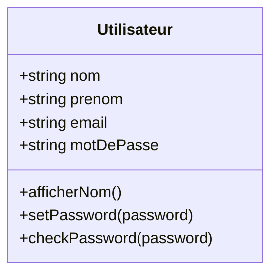

# Exemple de classe en PHP

```php
echo "Bonjour";
```


```mermaid
classDiagram
   class Utilisateur
   Utilisateur : +string nom
   Utilisateur : +string prenom
   Utilisateur : +string email
   Utilisateur : +string motDePasse
   Utilisateur : +afficherNom()
   Utilisateur : +setPassword(password)
   Utilisateur : +checkPassword(password) 
```